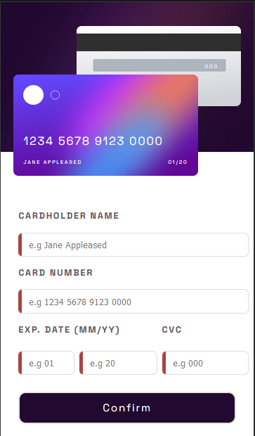
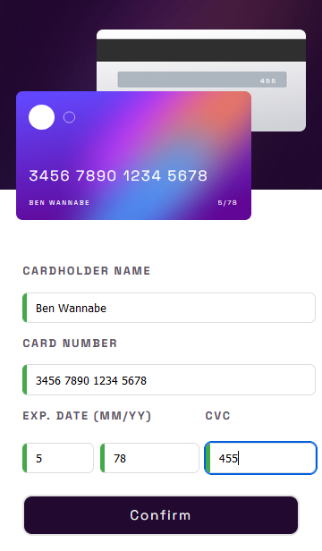
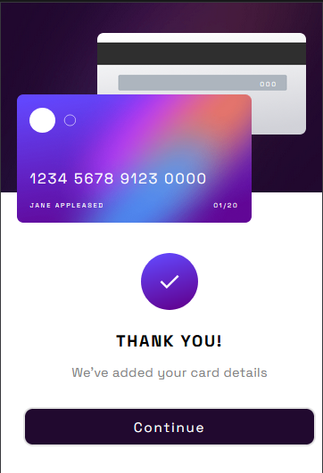
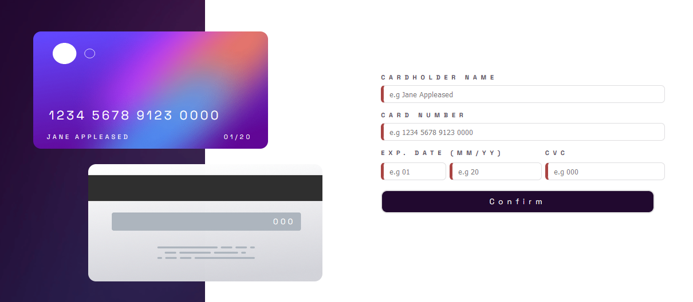
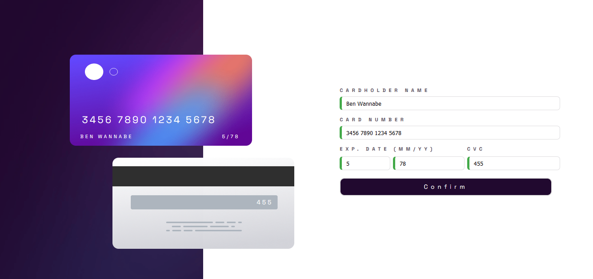
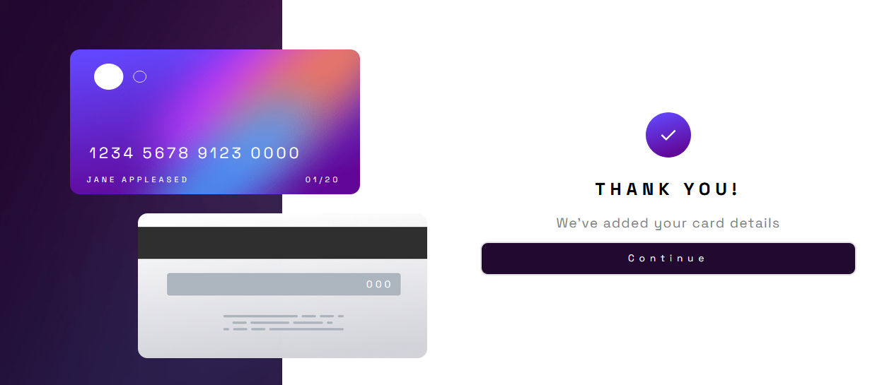

# Frontend Mentor - Interactive card details form

This is a solution to the [Interactive card details form challenge on Frontend Mentor](https://www.frontendmentor.io/challenges/interactive-card-details-form-XpS8cKZDWw). Frontend Mentor challenges help you improve your coding skills by building realistic projects. 

## Table of contents

- [Overview](#overview)
  - [The challenge](#the-challenge)
  - [Screenshot](#screenshot)
  - [Links](#links)
- [My process](#my-process)
  - [Preview function](#preview-function)
  - [Built with](#built-with)
  - [Author](#author)

## Overview

### The challenge

Users should be able to:

- View the optimal layout for the site depending on their device's screen size

### Screenshot

   

### Links

- Solution URL: [GitHub code solution URL](https://github.com/Kennedy-was-taken/card-details-form-main)
- Live site Url : [Vercel QR code app](https://card-details-form-main-umber.vercel.app)

### Preview functions

#### Mobile perspective:

  - Mobile view

  

  - Mobile fields filled

  

  - Mobile Success Popup

  

#### Desktop perspective:

  - Desktop view

  

  - Desktop fields filled

  

  - Desktop Success Popup

  

<!-- ### What I learned -->

  <!-- 1. Creating a Click Outside Directive in Angular:

      - Implemented a click outside directive within Angular to facilitate the closing of modal windows, tooltips, or dropdown menus.
      - Linked the directive to the HTML tag to ensure that clicking outside the designated area triggers the closing action.
      - Ensured that clicking within the designated area keeps the component open.

  2. Utilizing '@angular/animations' for Basic Animations:

      - Learned to integrate '@angular/animations' to animate sidebar actions in TypeScript.
      - Manipulated the opacity of a layer using triggers, states, transitions, and animations.
      - Implemented animations for opening and closing actions, enhancing user experience and interface interactivity.

  3. CSS Transformations and Animations:

      - Refreshed understanding of CSS transformations for manipulating the positioning of HTML elements at various keyframes.
      - Employed CSS animations to define animation properties, enabling keyframes to animate according to specified parameters.
      - By mastering these techniques, I've enhanced my ability to create dynamic and interactive user interfaces within Angular applications. -->

### Built with

- Semantic HTML5 markup
- Scss
- Flexbox
- Mobile-first workflow
- @media
- Angular

## Author

- Github Profile: [Kennedy-was-taken](https://github.com/Kennedy-was-taken)
- Frontend Mentor : [@Kennedy-was-taken](https://www.frontendmentor.io/profile/Kennedy-was-taken)

<!-- # card-details-form-main -->

